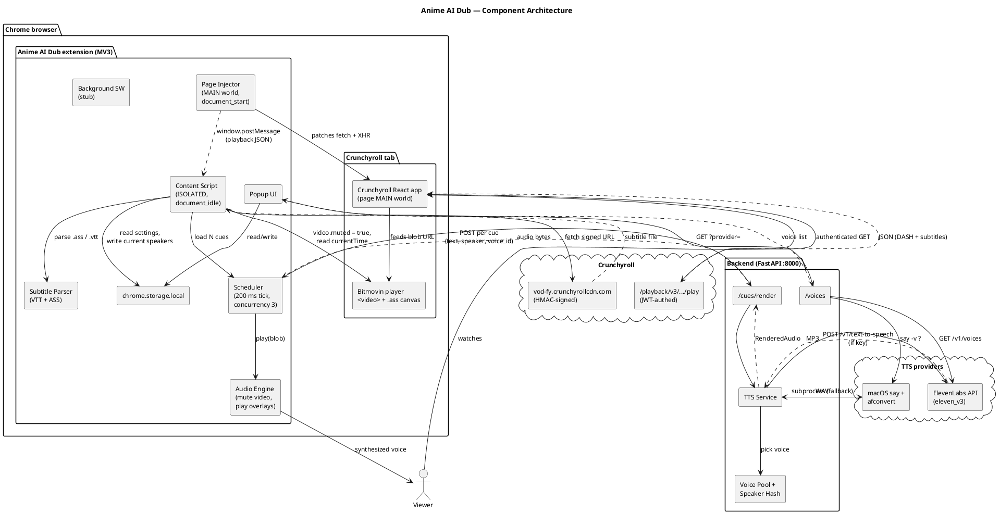
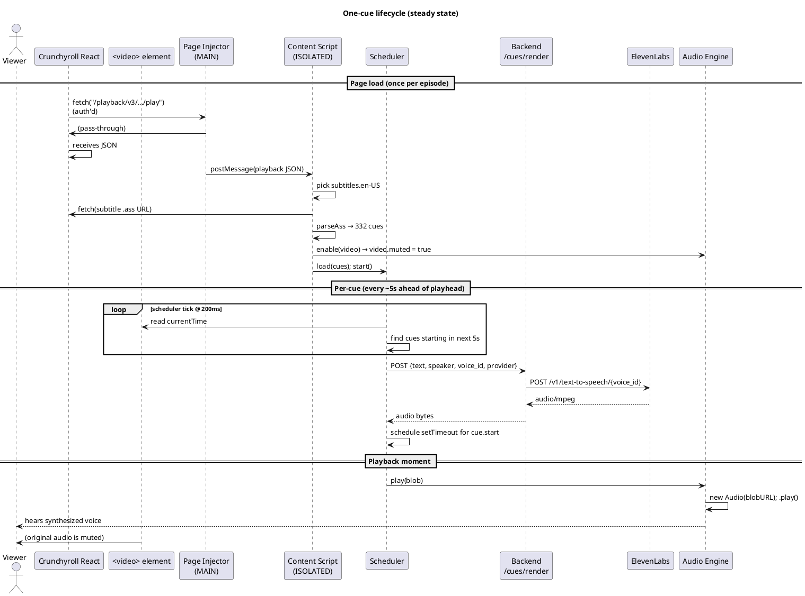

# Anime AI Dub — Architecture

A Chrome MV3 browser extension that mutes the original audio of a Crunchyroll episode and overlays an AI-generated voice dub from the existing subtitle track, with distinct voices per character. Backend FastAPI service handles TTS rendering.

## Components

### Browser extension (`extension/`)

| Component | Path | World / Lifetime | Responsibility |
|---|---|---|---|
| Page injector | `src/content/page-injector.ts` | Page MAIN world, `document_start` | Monkey-patches `fetch`/`XMLHttpRequest` in the page's JS context; captures the authenticated `/playback/v3/.../play` response and forwards it to the content script via `window.postMessage` |
| Content script | `src/content/index.ts` | Extension ISOLATED world, `document_idle` | Receives playback config, fetches subtitle file from Crunchyroll CDN, parses, wires scheduler + audio engine, reads/writes settings |
| Subtitle parser | `src/lib/subtitle.ts` | (lib) | Parses WebVTT and ASS (Advanced SubStation Alpha); strips override tags; extracts speaker name + style fields |
| Scheduler | `src/content/scheduler.ts` | (per page) | 200 ms tick loop; renders cues 5 s ahead of `video.currentTime`; concurrency 3; handles seek by re-evaluating state |
| Audio engine | `src/content/audio-engine.ts` | (per page) | Mutes `<video>` on enable, plays parallel `<audio>` blobs, pauses/resumes with video pause/play, stops all on seek |
| API client | `src/lib/api.ts` | (lib) | POST `/cues/render`, GET `/voices`; injects `X-Elevenlabs-Key` header |
| Settings | `src/lib/settings.ts` | (lib) | `chrome.storage.local` wrapper: provider, ElevenLabs key, per-speaker voice overrides, current-episode speaker list |
| Voice pool (fallback) | `src/lib/voices.ts` | (lib) | Hardcoded fallback voice lists if backend `/voices` fetch fails |
| Background service worker | `src/background/index.ts` | (MV3 worker) | Currently just install logging; no runtime role since pivot to page-injection |
| Popup UI | `src/popup/{index.html,index.ts}` | (browser action) | Provider toggle, ElevenLabs key input, per-character voice override dropdowns |

### Backend (`backend/`)

| Component | Path | Responsibility |
|---|---|---|
| FastAPI app | `app/main.py` | Mounts routers; CORS for `chrome-extension://` and `https://www.crunchyroll.com` origin |
| Config | `app/config.py` | `pydantic-settings` env loader (`.env` driven) |
| `/cues/render` route | `app/routes/cues.py` | Per-cue text → audio bytes; accepts `provider`, `speaker`, `voice_id`, `X-Elevenlabs-Key` |
| `/voices` route | `app/routes/voices.py` | Lists available voices for current provider (calls ElevenLabs `/v1/voices` or runs `say -v ?`) |
| TTS service | `app/services/tts.py` | Routes to ElevenLabs / macOS `say` / silent-WAV fallback |
| Voice mapping | `app/services/voices.py` | Deterministic `hash(speaker) → voice_id` from pool |

## External services & system tools

| Service | Status | Used for |
|---|---|---|
| Crunchyroll (`www.crunchyroll.com`) | live | Source of video, subtitle config, .ass/.vtt files |
| Crunchyroll CDN (`vod-fy.crunchyrollcdn.com`) | live | HMAC-signed subtitle file delivery |
| ElevenLabs API | live (optional, BYO key) | Production-quality TTS, model `eleven_v3` |
| macOS `say` + `afconvert` | live (dev only) | Free TTS fallback when no ElevenLabs key |
| Supabase (Auth + Postgres) | **planned** | User accounts, JWT-auth for multi-user mode |
| Stripe | **planned** | Per-character metered billing |
| Cloudflare R2 | **planned** | Per-user audio cache for popular episodes |

## Dependencies

### Extension (`extension/package.json`)

| Package | Use |
|---|---|
| `vite` | Build / watch |
| `@crxjs/vite-plugin` | MV3 manifest processing, content-script bundling, `world: "MAIN"` support |
| `typescript`, `@types/chrome` | TS + Chrome API types |
| `@supabase/supabase-js` | Installed for planned auth flow (not yet imported) |

### Backend (`backend/pyproject.toml`)

| Package | Use |
|---|---|
| `fastapi`, `uvicorn[standard]` | Web framework + ASGI server (run with `--reload`) |
| `pydantic-settings`, `python-dotenv` | Env config |
| `httpx` | Async client for ElevenLabs |
| `supabase` | Installed for planned auth (not yet imported) |
| `stripe` | Installed for planned billing (not yet imported) |
| `boto3` | Installed for planned R2 cache (not yet imported) |
| `pyjwt[crypto]` | Installed for planned Supabase JWT verification (not yet imported) |
| dev: `ruff`, `mypy`, `pytest` | Tooling |

### System

- Python 3.12+
- Node 20+
- macOS (only for `say` dev fallback; rest is cross-platform)
- Google Chrome 111+ (for `world: "MAIN"` content scripts)

## Architecture



### Per-cue runtime sequence



## Repository layout

```
anime/
├── ARCHITECTURE.md           ← this file
├── backend/
│   ├── pyproject.toml
│   ├── .env(.example)        ← optional ElevenLabs/Supabase/Stripe/R2 keys
│   └── app/
│       ├── main.py           ← FastAPI app + CORS
│       ├── config.py         ← pydantic-settings
│       ├── routes/
│       │   ├── cues.py       ← POST /cues/render
│       │   └── voices.py     ← GET /voices?provider=
│       └── services/
│           ├── tts.py        ← ElevenLabs / say dispatch
│           └── voices.py     ← speaker → voice hash
└── extension/
    ├── package.json
    ├── vite.config.ts
    └── src/
        ├── manifest.json     ← MV3 + world:MAIN content script
        ├── background/index.ts
        ├── content/
        │   ├── page-injector.ts   ← MAIN world fetch/XHR patch
        │   ├── index.ts           ← orchestrator
        │   ├── scheduler.ts       ← cue render + play scheduler
        │   └── audio-engine.ts    ← mute video, play overlays
        ├── popup/
        │   ├── index.html         ← provider + key + speaker overrides
        │   └── index.ts
        └── lib/
            ├── api.ts             ← backend client
            ├── settings.ts        ← chrome.storage wrapper
            ├── subtitle.ts        ← VTT + ASS parsers
            └── voices.ts          ← hardcoded fallback voice pool
```

## Configuration

All optional. Without any of these the extension still runs with macOS `say` and an in-extension API key.

### Backend `.env`

```
APP_ENV=development
APP_PORT=8000
EXTENSION_ORIGIN=                           # leave blank in dev (uses "*")

# ElevenLabs (optional — popup-stored key takes precedence per request)
ELEVENLABS_API_KEY=
ELEVENLABS_DEFAULT_VOICE_ID=21m00Tcm4TlvDq8ikWAM

# Planned (not yet wired):
SUPABASE_URL=
SUPABASE_ANON_KEY=
SUPABASE_SERVICE_KEY=
SUPABASE_JWT_SECRET=
STRIPE_SECRET_KEY=
STRIPE_WEBHOOK_SECRET=
STRIPE_METER_ID=
R2_ACCOUNT_ID=
R2_ACCESS_KEY_ID=
R2_SECRET_ACCESS_KEY=
R2_BUCKET=anime-dub-audio
R2_PUBLIC_URL=
```

### Extension settings (stored in `chrome.storage.local`)

- `provider`: `"say" | "elevenlabs" | "auto"` (default `"say"`)
- `elevenLabsApiKey`: string (default `""`)
- `voiceOverrides`: `Record<speaker, voice_id>` (default `{}`)

## Running locally

```bash
# Backend
python3 -m venv backend/.venv
backend/.venv/bin/pip install -e backend
backend/.venv/bin/uvicorn app.main:app --app-dir backend --reload --port 8000

# Extension
npm install --prefix extension
npm run dev --prefix extension       # vite build --watch
# Then in Chrome: chrome://extensions → Load unpacked → extension/dist/
```

## Notable design decisions

- **Page-injection over re-fetch.** `/playback/v3/.../play` requires a JWT the player holds privately; trying to re-fetch returns `{"error":"Unauthorized","reason":"missing_token"}`. So we observe the response the player already authenticated for, never re-request.
- **Single extraction path for both renderer types.** Some Crunchyroll shows render subs as DOM text (`<li>` overlays), others use canvas-rendered ASS with libass-style typography. Both go through `/playback/v3/.../play`, so capturing that JSON works for either. DOM observation was tried and removed.
- **Per-user audio cache, not shared cache.** If/when the cache layer ships, audio renders are keyed by `(user_id, episode_id, cue_index)`. Never serve one user's render to another — preserves a personal-use legal posture under a paid-service deployment.
- **Speaker name from ASS `Name` field.** Crunchyroll's official subs populate the dialogue `Name` field with real character names (Aki, Joe, Yashiro, ...). We hash that name to a voice ID from a pool — same character always gets the same voice. User can override per character in the popup.
- **Filter out sign cues.** ASS subs include text-on-screen overlays (style names containing "sign"). These are typography, not speech — filtered out at parse time so they're never voiced.
